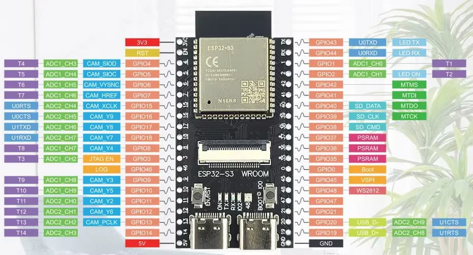

# Proyecto Iris - Release

Este repositorio contiene el código fuente completo del Proyecto Iris, un asistente inteligente integrado en hardware portátil. El proyecto se divide en dos componentes principales: el firmware del hardware (ESP32) y la aplicación cliente (Flutter).

## Estructura del Proyecto

```text
Proyecto_Iris_Release/
├── App_Flutter/      # Código fuente de la app móvil (Frontend + IA)
└── Hardware_ESP32/   # Código fuente del microcontrolador (Hardware)
```

## 1. Aplicación Móvil (App_Flutter)

La aplicación móvil está construida con Flutter y actúa como el cerebro y cliente del sistema. Se encarga de procesar el audio que recibe del ESP32, realizar la transcripción (Speech-to-Text), comunicarse con el agente de IA de Occipital, y gestionar la interfaz de usuario.

**Características principales:**
- Conexión vía WebSocket (Puerto 81) con el ESP32.
- Gestión de estados de hardware (PTT - Push To Talk).
- Recepción de buffers de audio en tiempo real y decodificación.

**Cómo correr la app:**
1. Asegúrate de tener Flutter instalado.
2. Abre la carpeta `App_Flutter` en tu terminal.
3. Ejecuta `flutter pub get` para instalar dependencias.
4. Conecta tu celular por USB (con depuración USB activada).
5. Ejecuta `flutter run` para compilar e instalar la app.

> **Importante:** La IP del ESP32 está hardcodeada en `lib/features/assistant/screens/assistant_screen.dart`. Si la IP del ESP32 cambia, debes actualizar la constante `ESP32_IP` en ese archivo.

## 2. Firmware del Prototipo (Hardware_ESP32)

El código del ESP32 está escrito en C++ y utiliza PlatformIO (o Arduino IDE). Su función principal es actuar como un servidor WebSocket que captura el audio del micrófono, envía los datos a la app móvil y reproduce el audio de respuesta a través de un amplificador I2S (MAX98357A).

**Características principales:**
- Servidor WebSocket (Puerto 81).
- Captura de audio analógico (Micrófono INMP441 / genérico).
- Salida de audio digital I2S (MAX98357A).
- Lectura de botón físico (Push to Talk) y envío de comandos `CMD_PTT_START` / `CMD_PTT_STOP`.

**Cómo compilar y subir el código:**
1. Abre la carpeta `Hardware_ESP32` usando PlatformIO en VS Code (o Arduino IDE).
2. Asegúrate de que las credenciales Wi-Fi en el código correspondan al Hotspot del celular que vas a usar.
3. Conecta el ESP32 por USB y presiona "Upload".

**Truco de conexión (IP):**
Como la app necesita saber la IP del ESP32, hemos programado una función especial: **Cada vez que presionas el botón físico del prototipo, el ESP32 imprimirá su dirección IP en el Monitor Serial.** Solo conecta el ESP32 a la PC, abre el monitor serial, presiona el botón, copia la IP resultante, y actualízala en el código de Flutter.

## Conexiones de Hardware (Pines ESP32-S3 WROOM)

A continuación se detalla el esquema de conexión exacto para que el hardware funcione con el código actual. Asegúrate de conectar los pines a sus respectivos VCC (3.3V o 5V) y GND.



### 🎙️ Micrófono I2S (Ej. INMP441)
- **SCK / BCLK** -> Pin 42
- **WS / L/R** -> Pin 41
- **SD / DOUT** -> Pin 40
- **L/R (Canal)** -> GND (Para usar canal izquierdo)

### 🔊 Amplificador de Audio I2S (Ej. MAX98357A)
- **LRC** -> Pin 1
- **BCLK** -> Pin 2
- **DIN** -> Pin 21

### 🔘 Botón Físico (Push-to-talk)
- **Un pin del botón** -> Pin 14
- **El otro pin del botón** -> GND (Usa resistencia pull-up interna del código)

## Problemas Frecuentes de Hardware

- **Audio roto o entrecortado:** Si al mover el prototipo el audio suena roto o deja de funcionar, es un falso contacto o un cortocircuito en los cables que van a la bornera del altavoz. Revisa que los cables estén bien apretados y el cobre no toque otros cables.
- **No se conecta al Hotspot:** Asegúrate de que el Hotspot del celular esté configurado para emitir en la banda de **2.4 GHz** (la opción "Maximizar compatibilidad" debe estar encendida en iOS/Android). El ESP32 no soporta 5 GHz.
